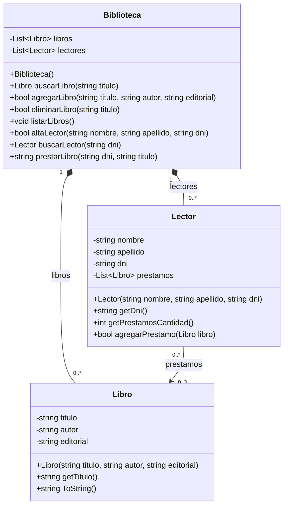

# TPBibliotecaE6

## Diagrama de clases UML

- `Biblioteca` contiene una colección de `Libro` y otra de `Lector`.
- Un `Lector` puede tener hasta tres libros prestados, según la regla implementada en `prestarLibro`.
- Un `Libro` puede aparecer en los préstamos de varios lectores porque el código actual no controla la disponibilidad global del ejemplar.
